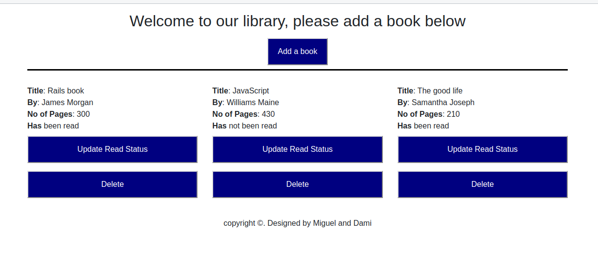

<h1 align="center">Welcome to Library 👋</h1>

<p>
  <a href="https://rawcdn.githack.com/damiecode/library/62179f3cc68f860c2025cfbde62c6c058b8f66a3/index.html" target="_blank">
    
  </a>
</p>
This project is part of a series of projects to be completed by students of [Microverse](https://www.microverse.org/ 'The Global School for Remote Software Developers!').


Library is a collaborative project by [Damilola Ale](https://github.com/damiecode) and [Miguel Prada](https://github.com/mapra99). The full project description can be found [here](https://www.theodinproject.com/courses/javascript/lessons/library).

## Built With

- JavaScript
- HMTL/CSS
- Bootstrap

## Usage

The live version of the webapp can be found [here](https://rawcdn.githack.com/damiecode/library/62179f3cc68f860c2025cfbde62c6c058b8f66a3/index.htmll)

> Clone the repository to your local machine

```sh
$ git clone https://github.com/damiecode/library.git
```

> cd into the directory

```sh
$ cd Library
```

> Open `index.html` using your favourite broswer: 

## Contributing

1. Fork it (https://github.com/damiecode/library/fork)
2. Create your feature branch (git checkout -b feature/[choose-a-name])
3. Commit your changes (git commit -am 'what this commit will fix/add')
4. Push to the branch (git push origin feature/[chosen-name])
5. Create a new Pull Request

## Contact me

  I am looking for my next opportunity. Reach out to me if you are looking to hire!
- Email: _codenlyn@gmail.com_
- Github: [@damiecode](https://github.com/damiecode)
- Twitter: [@iamlildamski](https://twitter.com/iamlildamski)
